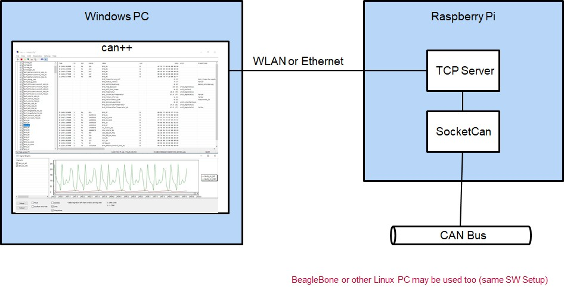
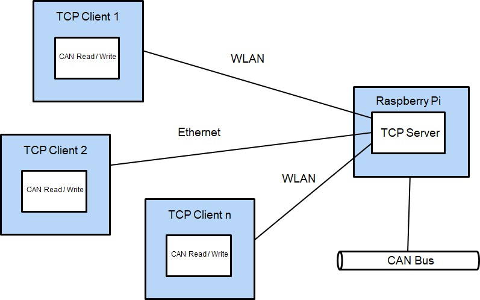

 CAN++

## Overview
CAN++ is a free Windows program for receiving, transmitting and analyzing (*.asc, *.blf) CAN bus messages (CAN Classic and **CAN FD**) for using with [SuperCAN](https://github.com/jgressmann/supercan) devices, with CAN devices connected via TCP/IP or without CAN hardware (virtual bus). After import of CAN data base files (*.**dbc**, *.**arxml**) CAN signals are shown in symbolic form. Signals can be presented as graphics (wave forms) too.

Furthermore:
- **CAN simulation** is possible by programming CAN behaviour in C++. 
- **CAN traces** can be generated, imported and replayed (*.asc format, *.blf can be imported).
- **Diagnostics** can be performed (PDX import, fault memory, measurement and identification data)

There are several devices which are supported by SuperCAN firmware and can be used with CAN++. For example:
- Open Source Hardware: [USB_CAN-FD](https://github.com/RudolphRiedel/USB_CAN-FD)
- Off the shelf: [Adafruit Feather M4 CAN Express](https://www.adafruit.com/product/4759) (simple [drag & drop](#tips) of firmware)

CAN++ also can connect to CAN hardware via TCP/IP with an own defined protocol (see TCP/IP chapter below). An example implementation is included.

CAN++ can be just started (no installation).   
The user manual is located in sub folder `doc/user_manual` (Markdown and HTML version, work in progress). 

## Traces
CAN traces can be generated, imported and replayed (*.asc format). Import and replay is possible with BLF files too (*.blf).

## CAN transmit

- cyclic, once, with time offset
- define signals as raw or physical values
- or define signals with wave configurator

## CAN simulation in C++

- compiler and IDE integrated, no installation needed
- one .cpp file per CAN node (see Example ECU_main.cpp)
- react on CAN-Messages (::onMessage()) or signals
- send CAN messages
- Timers (can be used for cyclic sending of CAN messages)
- print text

## CAN statistics

## CAN diagnostics
- faultmemory
- measurement data
- identification
- import PDX files

## TCP/IP connection to CAN hardware

CAN++ can connect over TCP/IP to CAN hardware. For this an own protocol was developed. A protocol implementation for connecting to a Linux device is located in folder "can2win".
This little server has to run on the Linux device. CAN++ connects to this server and transmitts and receives CAN data over the connection. The server itself makes a [SocketCan](https://de.wikipedia.org/wiki/SocketCAN#:~:text=SocketCAN%20ist%20eine%20Sammlung%20von,Level%20CAN%20Framework%20(LLCF).) connection to the CAN hardware attached to the linux device. This for example may be a simple Raspberry Pi CAN hookup board. Multiple channels can be transported. Even more multiple CAN++ PC's can connect to this server.
Following menu items can be used to connect:

Settings => Hardware Select:
- BeagleBone USB: 192.168.7.2
- Wlan: 192.168.10.1
- IP Address: self assigned IP address on server side

## Installation

CAN++ can be used without installation. It should not be placed in system folders like "C:\Programs". Path should contain "A-Za-z0-9_" only. Otherwise integrated Compiler will not work. By calling "INSTALL.bat" a shortcut is created on desktop.

## Tips
### How to flash SuperCAN firmware on Adafruit Feather M4 CAN Express (on Windows)
- download SuperCAN firmware file supercan-firmware.tar.xz from https://github.com/jgressmann/supercan/releases/tag/latest-master
- Unpack supercan-firmware.tar.xz (7-Zip could be used), needed file is supercan.uf2
- plug in device
- push the button on the device twice
- a drive "FTHRBOOT" will show up in file explorer
- drop the file supercan.uf2 on this drive
- after 10 seconds replug the device
