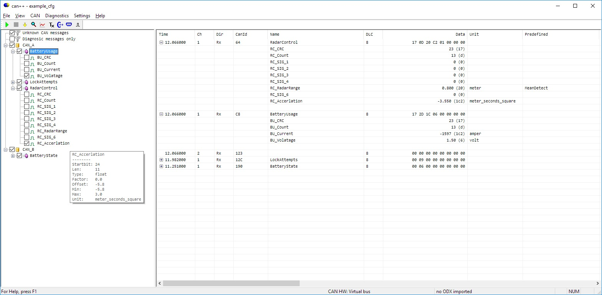
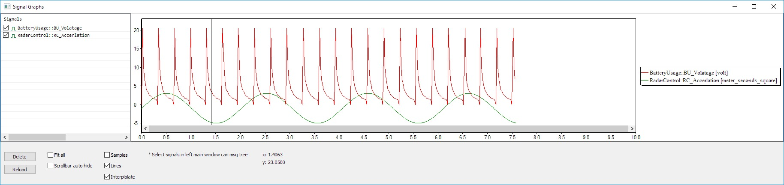
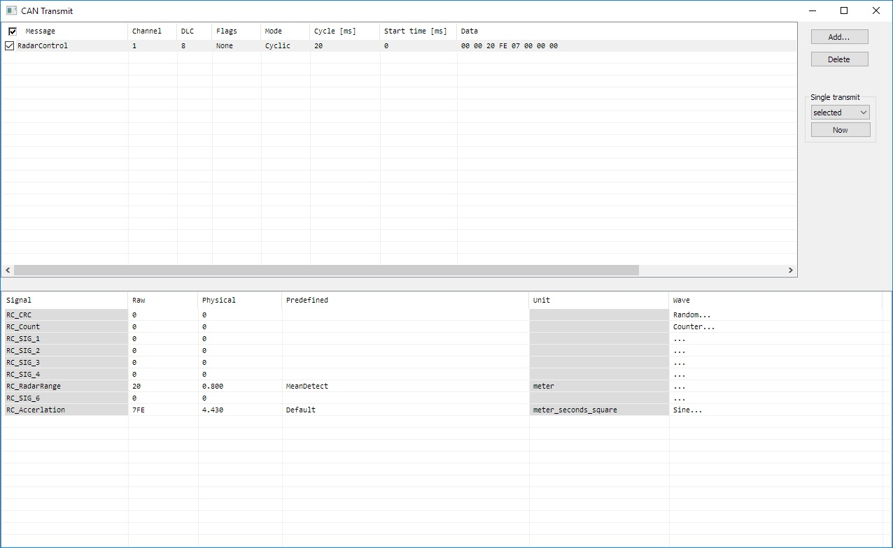
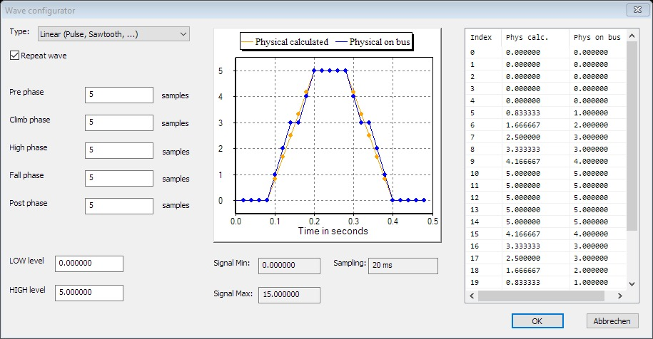
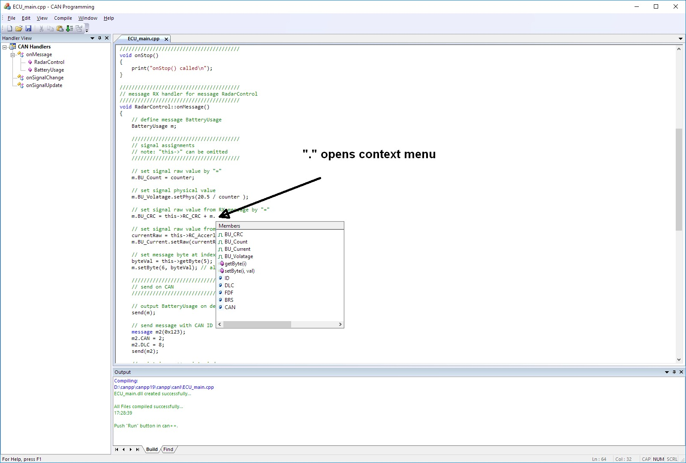
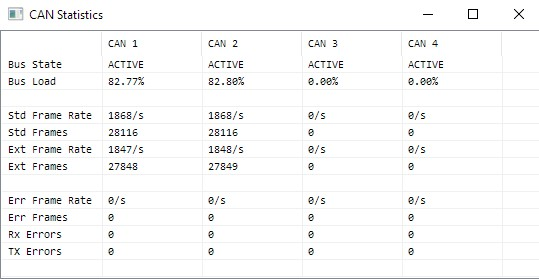
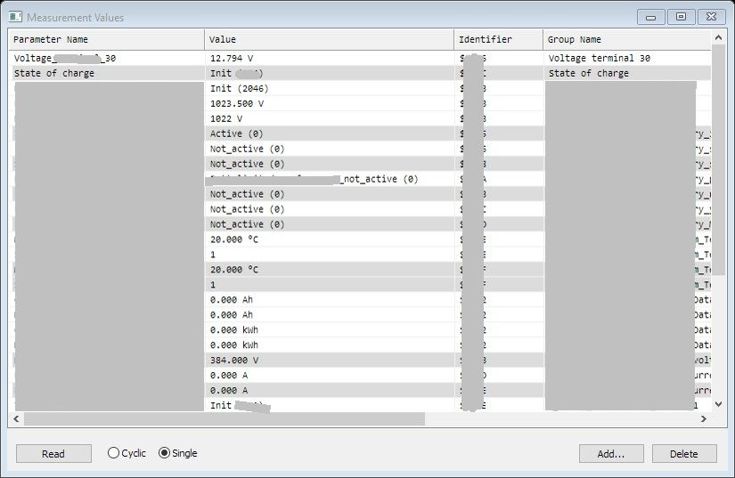

# CAN++

## Overview
CAN++ is a free Windows program for receiving and transmitting CAN bus messages (CAN Classic and **CAN FD**) for using with [SuperCAN](https://github.com/jgressmann/supercan)/[USB_CAN-FD](https://github.com/RudolphRiedel/USB_CAN-FD) or without CAN hardware (virtual bus). After import of CAN data base files (*.**dbc**, *.**arxml** or *.kcd) CAN signals are shown in symbolic form. In addition they can be shown as graphics (wave forms).
Note: *.kcd data base format is broken currently

Furthermore:
- **CAN simulation** is possible by programming CAN behaviour in C++. 
- **CAN traces** can be generated, imported and replayed (*.asc format, *.blf can be imported).
- **Diagnostics** can be performed (PDX import, fault memory, measurement and identification data)

CAN++ can be just started (no installation).

## Traces
CAN traces can be generated, imported and replayed (*.asc format). Import and replay is possible with BLF files too (*.blf).

## CAN transmit

- cyclic, once, with time offset
- define signals as raw or physical values
- or define signals with wave configurator

## CAN simulation in C++

- one .cpp file per CAN node
- react on CAN-Messages (::onMessage()) or signals
- send CAN messages
- Timers (can be used for cyclic sending of CAN messages)
- print text
- integrated IDE and integrated C++ Compiler (DMC)

## CAN statistics

## CAN diagnostics
- faultmemory
- measurement data
- identification
- import PDX files

## Installation

CAN++ can be used without installation. It should not be placed in system folders like "C:\Programs". Path should contain "A-Za-z0-9_" only. Otherwise integrated Compiler will not work. By calling "INSTALL.bat" a shortcut is created on desktop.