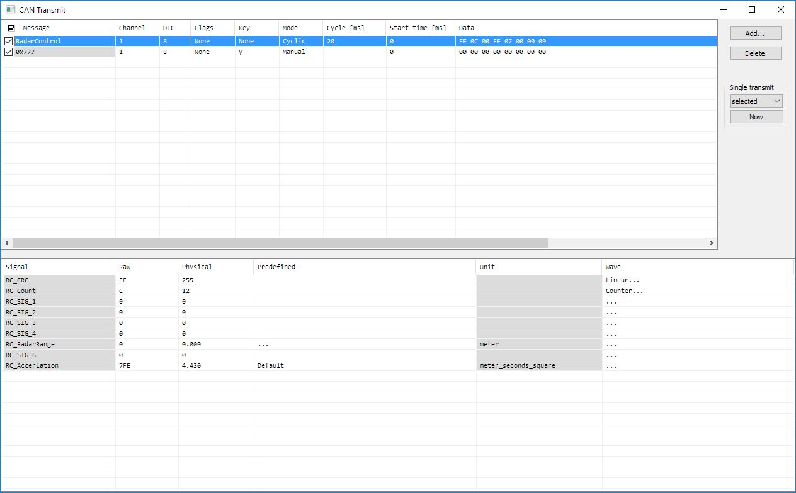
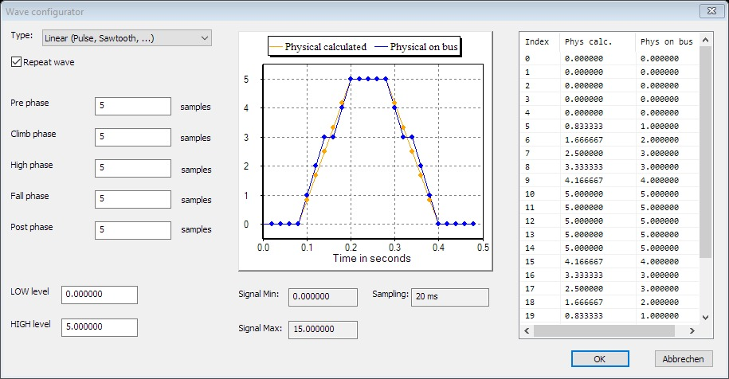
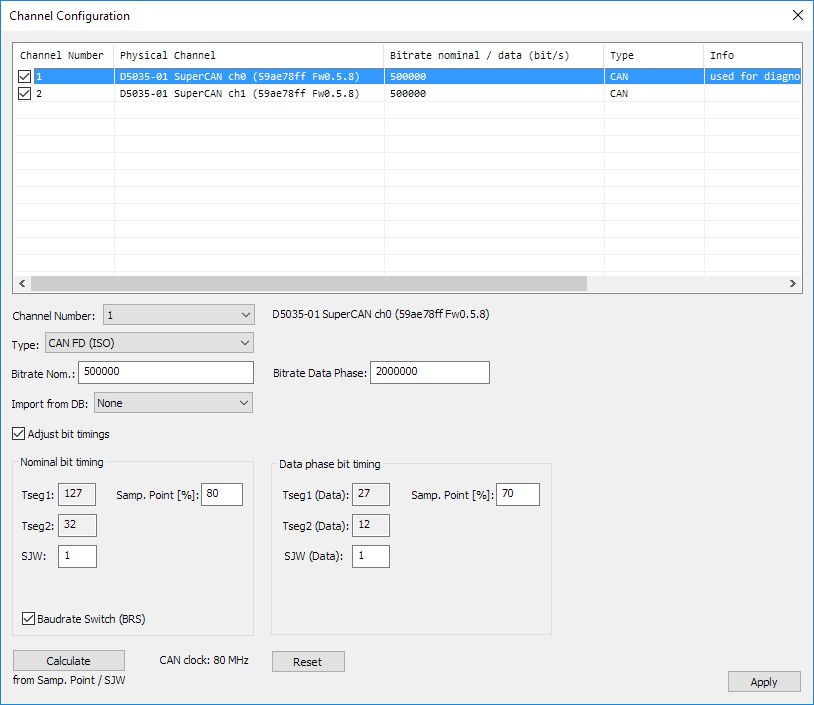
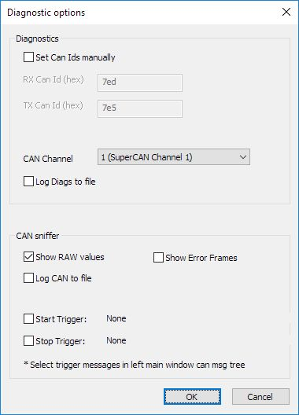
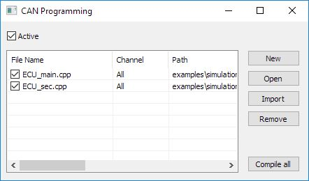
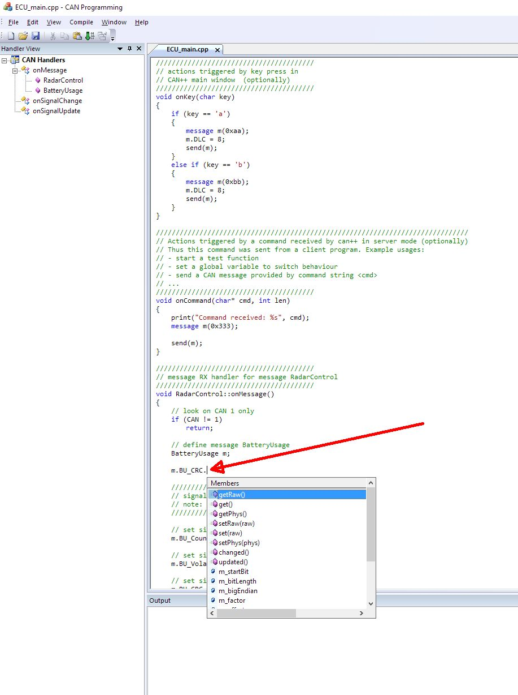
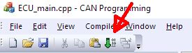
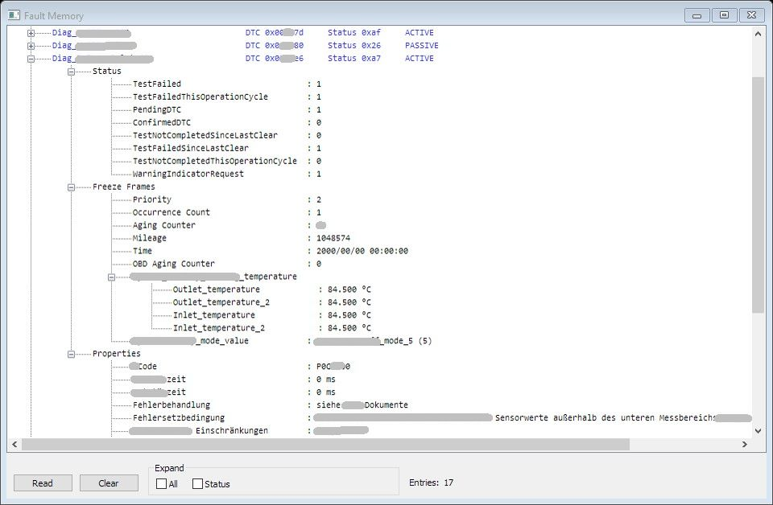
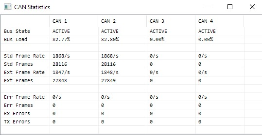

# CAN++ User Manual

## Overview
CAN++ is a free Windows program for receiving, transmitting and analyzing (*.asc, *.blf) CAN bus messages (CAN Classic and **CAN FD**) for using with [SuperCAN](https://github.com/jgressmann/supercan) devices or without CAN hardware (virtual bus). After import of CAN data base files (*.**dbc**, *.**arxml**) CAN signals are shown in symbolic form. Signals can be presented as graphics (wave forms) too.

Furthermore:  

- **CAN simulation** is possible by programming CAN behaviour in C++.  
- **CAN traces** can be generated, imported and replayed (*.asc format, *.blf can be imported).  
- **Diagnostics** can be performed (PDX import, fault memory, measurement and identification data)  

There are several devices which are supported by SuperCAN firmware and can be used with CAN++. For example:
- Open Source Hardware: [USB_CAN-FD](https://github.com/RudolphRiedel/USB_CAN-FD)
- Off the shelf: [Adafruit Feather M4 CAN Express](https://www.adafruit.com/product/4759) (simple [drag & drop](#tips) of firmware)

CAN++ can be just started (no installation).

## CAN data bases

CAN data bases files (*.dbc, *.arxml) can be imported via menu:
~~~ 
CAN => CAN Data Base => Import... 
~~~

or in the left tree view in the main window by:  

- right mouse click and "Import Data Base..."
- drag and drop data base where multiple data base files can be dropped at once

## CAN transmit
CAN messages can be transmitted via menu:
~~~ 
CAN => Transmit...
~~~

The features are:

- send options:
    - cyclic
    - once
    - with time offset
    - manual by key
    - manual by click on button "Now"
- define signals as raw or physical values  
- or define signals with wave configurator  

By clicking on cell in column "**Wave**" for a signal a wave form can be specified for a signal instead of using a static value:

## CAN hardware configuration

### Activate hardware

Select connected hardware from list
~~~ 
Settings => Hardware Select 
~~~

### Change hardware configuration
Go to
~~~ 
Settings => Channel Configuration
~~~
Select a channel in the list to see its parameters. Pushing **Apply** will set the parameters. The checkbox determines whether the channel is active or not.

#### Dialog data

widget | function | notes |
------ | ------|---------|
Channel Number | logical channel number | This number is used in all other dialogs. So this number maps to the selected physical channel in the list above.
Type | CAN type | CAN classic or CANFD type
Import from DB | import channel settings from DBC |
Adjust bit timings | enable bit timing config | bit timing parameters widget show up
Calculate | calculate bit timing values | values are calculated based on Sample Point value
Reset | undo changes in bit timings
## Options
Go to
~~~ 
Settings => Options
~~~

### Diagnostic options

widget | function | notes |
------ | ------|---------|
Set Can Ids manually | assign Diagnostic CAN Ids | allows setting  CAN Ids for RX/TX. Otherwise CAN Ids are taken from ODX
CAN Channel | channel for diagnostics
Log Diags to file | log diagnostic data to folder **log**

### CAN sniffer options

widget | function | notes |
------ | ------|---------|
Show RAW values | show signal raw | beside physical signal value show raw bus signal value too
Show Error Frames | error frame enable | if enabled trace performance may go down
Log CAN to file | log CAN data to folder **log**
Start Trigger | Start CAN Id trigger | CAN Id which triggers trace/simulation start, which is chosen in CAN DB tree in left main window by right mouse click
Stop Trigger | Stop CAN Id trigger | CAN Id which triggers trace/simulation stop, which is chosen in CAN DB tree in left main window by right mouse click

## Remote control

CAN++ can be remote controlled. To do so start CAN++ with option `-server` on command line:
~~~
can++.exe -server
~~~
Currently following actions can be taken:  

- Start CAN bus  
- Stop CAN bus  
- Send a generic command to C++ simulation, which can be used to trigger self-defined actions, examples may be:  

    - call a test function  
    - set a global variable to switch behaviour  
    - send a CAN message provided by command string  
    - etc.  

Please see client example source code (Python, C# and C++) in folder examples/remote_control.

## Filtering

Filtering is done by the check boxes in the left tree view in the main window. If a check box is deselected than corresponding data base, can message or channel is filtered out in trace view window. Apart from that the check boxes for signals work es enable/disable for graphical view.

## CAN signal graphs

CAN signals can be shown as graphs by:
~~~ 
CAN => Graph...
~~~

Enabling signals as graphs is done by the check boxes in the left tree view in the main window.

## CAN programming in C++

CAN++ comes with an IDE and an integrated C++ compiler. So not further installation is needed. For each C++ file a separate DLL will be created on compiling. Each DLL is loaded when pushing button **Start** in CAN++. Please have a look at the example C++ file "**ECU_main.cpp**" in folder examples/simulation to see the features of CAN programming which are:

- second and milisecond timers (can be used to send cyclic messages for instance)
- react on messages on bus (::onMessage())
- react on signal changes
- print messages (print window in CAN++: "CAN" => "Print Output...")
- react on key presses
- react on commands received from remote client program (See chapter "Remote control")

Instead of the CAN++ IDE you can use your own of course. After first compiling of code CAN++ generates C++ classes for all CAN messages and signals (see canl/canl_data.cpp) so another IDE will give context input support too.

C++ files are managed by:
~~~ 
CAN => Programming
~~~

The checkbox **Active** is used to enable/disable CAN simulation by C++. Files can be imported or created. Existing files can be double clicked to open the IDE. A specific Channel can be selected from drop down in column **Channel**. Default "All" means that all received CAN traffic is routed to corresponding C++ file.

In the IDE you get context drop down menus for CAN data base variables like in following image:

Furthermore by right click at the cursor position you get a drop down menu with "**Insert Database Element**" to select a CAN message from Database Browser.  

To compile all C++ files do:
~~~ 
Compile => Compile All
~~~

or press on the green arrow icon in the toolbar:

Compiler errors will be shown in the "**Output**" window. By double clicking on a red error message cursor will jump to the corresponding line in the editor.

## CAN diagnostics

Following CAN diagnostics can be performed:  

- faultmemory (read and clear)
- measurement data (cyclic and single read)
- identification
- import PDX files

Fault memory window:

Measurements window:

## CAN statistics

CAN statistics are show in separate window by:
~~~ 
CAN => Statistics
~~~

